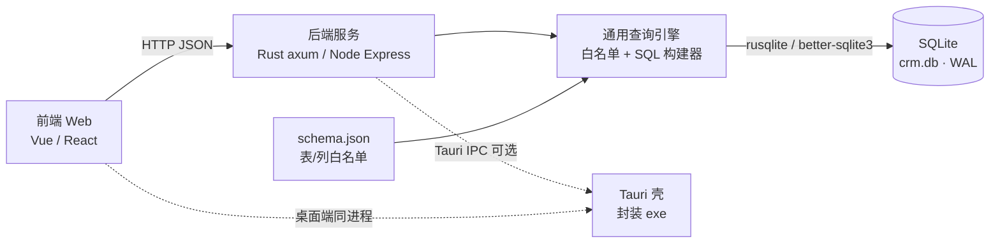

# 客户管理系统 API 接口文档

> [!info] 文档定位
> 1. 本文档是**可直接照此实现的接口契约**，覆盖 61 张 `CREATE TABLE` 的全部增删改查。
> 2. 核心能力：**任意表**都可以「按主键查 / 按唯一键查 / 按任意列单条件查 / 多列联合查（AND、OR、括号分组）」。
> 3. 字段清单不手抄——由 `tools/build_api_docs.py` 解析建库 SQL 自动生成，见 **附录 A**，并同步产出机器可读的 `客户管理系统表结构元数据.json`（后端用它做**表白名单 / 列白名单**）。
> 4. 设计原则：**一套通用动态查询引擎 + 少量业务聚合接口**。不为 61 张表写 61 套代码，只维护「表名 → 列定义」的白名单元数据。

---

## 一、总体设计

### 1.1 架构与调用链



- **对外形态**：标准 REST + JSON。前端无论跑在浏览器还是 Tauri 内嵌 WebView，调用方式完全一致。
- **Tauri 集成**：后端随 exe 一起打包（推荐 Rust 内嵌 axum，监听 `127.0.0.1` 随机端口；也支持把同一套 handler 注册为 Tauri command），详见**第十二章**。
- **元数据驱动**：后端启动时加载 `客户管理系统表结构元数据.json`，得到 61 张表、838 个列的**白名单**。所有动态查询必须在这份白名单内解析，**不存在任何字符串拼接进 SQL 的路径**。

### 1.2 为什么这样设计（对应你的三点要求）

| 你的要求 | 本方案实现 |
| --- | --- |
| 每个表都能增删改查 | 通用 CRUD 六件套，路径 `/{表名}`，**61 张表零改动复用** |
| 按列名单独查询 / 联合查询 | `filter[列名]` + 后缀操作符 + `logic=or` / `or[...]` 分组 / `where` 表达式 / `POST /query` 嵌套条件树 |
| 可以通过表的键查询 | 主键 `/{表名}/{id}`；唯一键 `/{表名}/{列}/{值}` 与 `?filter[唯一列]=值`；复合唯一键（如 `project_member` 的 `project_id+person_id`）同样支持 |

### 1.3 命名与格式约定（全库统一）

| 项 | 约定 |
| --- | --- |
| 资源路径 | **等于表名**：`/api/v1/{table}`，`table` 取 `snake_case` 原始表名（如 `customer_sales_data`、`entsales_customer_share`） |
| 参数名 | 等于列名，**不做驼峰转换**（前端若需 camelCase，可在网关层加开关，默认关闭） |
| 金额 | `REAL`，单位**万元**；响应原样返回，不做格式化 |
| 日期时间 | `TEXT`，ISO8601：`YYYY-MM-DD` / `YYYY-MM-DD HH:MM:SS` |
| 布尔 | `INTEGER`，`0/1`（**不是** `true/false`） |
| 枚举 | 中文字符串，取值见附录 A「枚举」列，非法值返回 `40001` |
| JSON 列 | `TEXT` 存 JSON 字符串；写入时传**对象/数组**，后端 `json.dumps` 后落库；读取时**默认自动反序列化**为对象（可通过 `raw=1` 关闭） |
| 空值 | 未传字段 = 不修改；显式传 `null` = 置为 `NULL`；空字符串 `""` 视为**有效值**（独立于 `NULL`） |

---

## 二、通用约定

### 2.1 Base URL 与版本

```
Web 端：  /api/v1              （前端与后端同源，或由 Nginx / Vite proxy 转发）
桌面端：  http://127.0.0.1:{port}/api/v1   （Tauri 启动后端后动态注入端口）
```

版本号在路径中显式声明（`v1`），后续不兼容变更走 `v2`。

### 2.2 请求头

| Header | 必填 | 说明 |
| --- | --- | --- |
| `Content-Type` | 写操作为是 | `application/json; charset=utf-8` |
| `Accept` | 否 | `application/json` |
| `X-Request-Id` | 否 | 前端可选传入，便于链路追踪；未传由后端生成 |
| `X-Operator` | 否 | 操作人（写入 `dashboard_update_log.operator` 等审计字段用） |
| `Authorization` | 否 | 若启用登录，`Bearer {token}`；当前版本可先留空，见 11.8 |

### 2.3 统一响应体

**成功（单对象 / 写操作）**

```json
{
  "code": 0,
  "message": "ok",
  "requestId": "b1f0c3a4e5d6",
  "data": { "id": 12, "name": "某某银行" }
}
```

**成功（列表 / 分页）**

```json
{
  "code": 0,
  "message": "ok",
  "requestId": "b1f0c3a4e5d6",
  "data": {
    "items": [ { "id": 12, "name": "某某银行" } ],
    "page": 1,
    "page_size": 20,
    "total": 137,
    "page_count": 7
  }
}
```

**失败**

```json
{
  "code": 40001,
  "message": "字段校验失败",
  "requestId": "b1f0c3a4e5d6",
  "errors": [
    { "field": "category", "reason": "取值不在枚举内", "expected": ["主客户", "关联客户"], "actual": "主客户A" }
  ],
  "data": null
}
```

| 约定 | 说明 |
| --- | --- |
| `code` | `0` = 成功；非 0 = 业务错误码（见第十三章） |
| `message` | 面向开发者/可直接 toast 的中文提示 |
| `errors[]` | 仅校验类错误返回，逐字段定位，前端可高亮表单 |
| `data` | 失败时为 `null`；删除成功返回 `null` 或 `{"deleted":1}` |
| HTTP 状态码 | 同时保持语义正确：`200/201` 成功、`400` 参数错、`404` 不存在、`409` 唯一键冲突、`422` 约束失败、`500` 服务端异常 |

### 2.4 写操作的请求体

- `POST`（新增）：body = 一行记录的对象，键为列名。**只允许白名单列**，未知键返回 `40004`。
- `PUT`（整体替换）：body 中未出现的列将被置为默认值 / `NULL`（等价于清空后重写，慎用）。
- `PATCH`（局部更新）：body 中出现的列才更新，其余保持不动。**前端表单保存优先用 `PATCH`。**
- 自增主键 `id`、以及带 `DEFAULT` 的 `created_at` / `updated_at` 由后端自动处理，传入将被忽略并记 `warning`。

---

## 三、通用 CRUD 接口（对全部 61 张表生效）

记 `{table}` ∈ 附录 A 表清单（如 `customer`、`project`、`customer_budget`…）。

### 3.1 接口一览

| 方法 | 路径 | 说明 |
| --- | --- | --- |
| `GET` | `/api/v1/{table}` | **列表查询**（动态条件 + 排序 + 分页） |
| `GET` | `/api/v1/{table}/{id}` | **按主键查询**单条 |
| `GET` | `/api/v1/{table}/{column}/{value}` | **按指定列（唯一键/普通列）查询** |
| `GET` | `/api/v1/{table}/count` | 满足条件的记录数 |
| `GET` | `/api/v1/{table}/exists` | 是否存在（返回 `{"exists":true}`） |
| `POST` | `/api/v1/{table}` | **新增**单条 |
| `POST` | `/api/v1/{table}/batch` | **批量新增**（单事务） |
| `POST` | `/api/v1/{table}/query` | **复杂联合查询**（POST + JSON 条件树，见 6.6） |
| `POST` | `/api/v1/{table}/upsert` | 按唯一键 **插入或更新** |
| `PUT` | `/api/v1/{table}/{id}` | **整体替换**单条 |
| `PATCH` | `/api/v1/{table}/{id}` | **局部更新**单条 |
| `PATCH` | `/api/v1/{table}/batch` | 按主键批量局部更新 |
| `DELETE` | `/api/v1/{table}/{id}` | **按主键删除** |
| `DELETE` | `/api/v1/{table}` | **按条件删除**（必须带至少 1 个 `filter`，否则 `40005`） |
| `DELETE` | `/api/v1/{table}/batch` | 按主键批量删除 |
| `GET` | `/api/v1/{table}/{id}/{child}` | **级联子表查询**（如 `/project/8/project_member`） |
| `PUT` | `/api/v1/{table}/{id}/{child}` | **级联子表整体替换**（先删后插，单事务） |
| `GET` | `/api/v1/{table}/export` | 按当前查询条件导出 CSV（`format=csv\|xlsx`） |

### 3.2 列表查询 `GET /api/v1/{table}`

| 参数 | 类型 | 默认 | 说明 |
| --- | --- | --- | --- |
| `<列名>` / `filter[<列名>]` | any | — | 等值条件，可多个，默认 AND |
| `filter[<列名>__<操作符>]` | any | — | 带操作符的条件，见第六章 |
| `or[...]` | any | — | OR 分组 |
| `where` | string | — | 受限 SQL 风格表达式（6.5） |
| `logic` | `and`\|`or` | `and` | 同层 `filter` 之间的连接方式 |
| `q` | string | — | 全局关键词模糊搜索（对所有 `TEXT` 列做 `LIKE %q%`，OR 连接） |
| `select` | string | `*` | 返回列裁剪，逗号分隔，如 `select=id,name,level` |
| `order_by` | string | 主键 `asc` | 排序，支持多列：`order_by=year:desc,created_at:desc`；`-col` 等价 `col:desc` |
| `page` | int | `1` | 页码，从 1 开始 |
| `page_size` | int | `20` | 每页条数，**上限 200**，超过返回 `40006` |
| `limit` / `offset` | int | — | keyset / 深分页模式，与 `page` 互斥 |
| `distinct` | `0\|1` | `0` | 去重 |
| `group_by` | string | — | 分组列，逗号分隔 |
| `agg` | string | — | 聚合：`sum(amount):total,count(*):cnt` |
| `expand` | string | — | 展开外键对象（belongsTo），如 `expand=customer` |
| `children` | string | — | 内联子表数组（hasMany），如 `children=project_member,person` |
| `raw` | `0\|1` | `0` | `1` 时 JSON 列返回原始字符串 |
| `count_only` | `0\|1` | `0` | 只返回 `total`，不返回 `items`（适合大数据量翻页） |

**示例：按列名联合查询（AND）**

```http
GET /api/v1/customer?level=TOP1000大客户&industry=金融&page=1&page_size=20
```
等价 SQL：
```sql
SELECT * FROM customer WHERE level = ? AND industry = ? ORDER BY id ASC LIMIT 20 OFFSET 0;
```

**示例：关键词 + 排序 + 字段裁剪**

```http
GET /api/v1/customer?q=银行&select=id,name,level,account_manager&order_by=updated_date:desc
```

### 3.3 按主键查询 `GET /api/v1/{table}/{id}`

```http
GET /api/v1/project/8
```
- 不存在返回 `404` + `code=40401`。
- 支持 `expand` / `children` / `raw`，例如一次性拿项目及其 C74111 与成员：

```http
GET /api/v1/project/8?expand=customer&children=project_member,project_c74111,project_action_plan
```

### 3.4 按键查询 `GET /api/v1/{table}/{column}/{value}`

除主键外，**任意列**都可作为查询键（唯一列命中 1 条，非唯一列返回列表）：

| 场景 | 示例 | 说明 |
| --- | --- | --- |
| 唯一业务键 | `GET /api/v1/customer/crm_code/C0001` | `crm_code` 有 `UNIQUE`，返回单对象 |
| 复合唯一键 | `GET /api/v1/project_member/project_id=8&person_id=3`（见下） | 用 `filter` 更自然 |
| 普通列 | `GET /api/v1/person/customer_id/12` | 返回列表（分页参数同样适用） |
| 外键列 | `GET /api/v1/project/customer_id/5` | 等价 `?filter[customer_id]=5` |

复合唯一键（附录 A 标注了全部 `唯一键`）用 `by` 形态表达更清晰：

```http
GET /api/v1/project_member/by?project_id=8&person_id=3          # 命中唯一键 (project_id, person_id)
GET /api/v1/customer/by?crm_code=C0001                          # 命中唯一键 (crm_code)
```
- 传了完整唯一键 → 返回**单对象** `data`；
- 只传部分键 → 降级为**列表查询**；
- `project_id + person_id` 缺失时返回 `40002`。

> 唯一键清单（共 10 处，见附录 A）：
> - **单列唯一（3）**：`customer.crm_code`、`customer_profile.customer_id`、`project_c74111.project_id`
> - **复合唯一（7）**：`person_form(person_type,person_id)`、`person_disc(person_type,person_id)`、`project_member(project_id,person_id)`、`coop_entity_project_rel(coop_entity_id,project_id)`、`partner_person_project_rel(partner_person_id,project_id)`、`competitor_person_project_rel(competitor_person_id,project_id)`、`visit_our_staff(visit_id,internal_person_id)`

### 3.5 新增 `POST /api/v1/{table}`

```http
POST /api/v1/customer
Content-Type: application/json

{
  "crm_code": "C0001",
  "name": "某某银行股份有限公司",
  "category": "主客户",
  "level": "TOP1000大客户",
  "industry": "金融",
  "key_scenes": ["核心交易区", "数据中台"]      // JSON 列：传数组，后端序列化
}
```
响应 `201`：
```json
{ "code": 0, "message": "ok", "data": { "id": 1 } }
```
后端处理：未知列 → `40004`；必填缺失（`NOT NULL`）→ `40001`；枚举越界 → `40001`；唯一键冲突 → `409` + `code=40901`；`CHECK` 约束失败 → `422`。

### 3.6 批量新增 `POST /api/v1/{table}/batch`

```json
{ "items": [ { "crm_code": "C0002", "name": "A公司" }, { "crm_code": "C0003", "name": "B公司" } ] }
```
- **单事务**，全成功或全回滚；默认逐条校验。
- 可选 `"mode": "strict" | "relaxed"`：`relaxed` 跳过失败行并返回 `failed[]` 明细。
- 上限 `items.length ≤ 1000`，超出 `40007`。

响应：
```json
{ "code": 0, "data": { "inserted": 2, "ids": [2, 3] } }
```

### 3.7 局部更新 `PATCH /api/v1/{table}/{id}`

```http
PATCH /api/v1/customer/1
{ "account_manager": "张三", "remark": null }     // remark 显式置 NULL
```
- 更新 0 行（不存在）→ `404`。
- 返回 `{"updated":1,"changed":[{"column":"account_manager","from":"李四","to":"张三"}]}`，便于前端提示。
- 自动刷新 `updated_at`（存在该列时）。

### 3.8 整体替换 `PUT /api/v1/{table}/{id}`

语义为「用 body 完整覆盖该行」：未出现在 body 的可空列将被置 `NULL`。
`customer_profile`（1:1 表）推荐用法：找不到就建、找到就整体写 → 或直接用 `upsert`。

### 3.9 批量更新 `PATCH /api/v1/{table}/batch`

```json
{
  "ids": [1, 2, 3],
  "patch": { "industry": "金融" }
}
```
或按行更新：
```json
{ "items": [ { "id": 1, "level": "P1" }, { "id": 2, "level": "P2" } ] }
```
单事务执行，返回 `{"updated": 3}`。

### 3.10 删除 `DELETE /api/v1/{table}/{id}`

- 依赖 `ON DELETE CASCADE` 的外键，子表记录会被 SQLite 连带删除（见 11.4 的 `PRAGMA foreign_keys=ON`）。
- 返回 `{"deleted":1}`；不存在返回 `404`。
- 支持 `?dry_run=1` 预演：返回**将被级联删除的子表行数与明细**，供前端二次确认。

```http
DELETE /api/v1/customer/5?dry_run=1
→ { "code":0, "data": { "customer": 1, "project": 7, "person": 23, "visit_record": 12, ... } }
```

### 3.11 按条件删除 `DELETE /api/v1/{table}`

```http
DELETE /api/v1/customer_news?filter[customer_id]=5&filter[is_new]=0
```
- **必须有至少一个 `filter` 或 `where`**，否则 `40005`（防误删全表）。
- 可选 `?confirm=YES` 配合 `dry_run` 实现两段式删除。

### 3.12 计数与存在性

```http
GET /api/v1/project/count?filter[info_type]=商机&filter[level__in]=P1,P2
→ { "code":0, "data": { "count": 12 } }

GET /api/v1/customer/exists?crm_code=C0001
→ { "code":0, "data": { "exists": true } }
```

### 3.13 聚合统计

```http
GET /api/v1/customer_sales_data?filter[customer_id]=5&group_by=year&agg=sum(total_amount):total,sum(received_amount):received,count(*):cnt&order_by=year:desc
```
```json
{ "code": 0, "data": { "items": [
  { "year": 2025, "total": 3200.5, "received": 2100.0, "cnt": 1 },
  { "year": 2024, "total": 2800.0, "received": 2650.0, "cnt": 1 }
] } }
```
- 聚合函数白名单：`count`、`count_distinct`、`sum`、`avg`、`min`、`max`。
- 别名后必须用 `:alias`（无别名时后端生成 `sum_amount` 形式）。
- 聚合结果不走分页（除非显式传 `group_by` 同时传 `page`）。

### 3.14 级联子表接口

```http
GET    /api/v1/customer/5/project?page=1&page_size=10       # 客户的 projects（分页）
GET    /api/v1/project/8/project_member                      # 项目成员
PUT    /api/v1/project/8/project_member                      # 整体替换成员（数组 body）
DELETE /api/v1/customer/5/visit_record?filter[method]=面访     # 级联删除的定向清理
```

`PUT` 整体替换示例（多对多关系极常用）：
```http
PUT /api/v1/project/8/project_member
[
  { "person_id": 3, "adur_role": "A", "attitude": "+", "is_mentor": 0 },
  { "person_id": 7, "adur_role": "U", "attitude": "=", "p3p4_flags": {"p1": true} }
]
```
→ 单事务：`DELETE WHERE project_id=8` 后批量插入，返回 `{"replaced":2}`。

### 3.15 导出

```http
GET /api/v1/customer/export?filter[industry]=金融&format=csv&select=id,name,level
```
返回 `Content-Type: text/csv; charset=utf-8`（带 BOM，Excel 直开不乱码），或 `xlsx`。

---

## 四、请求体（写操作）通用规则

1. **未知列拒绝**：body 中出现非表列的键 → `40004`，附 `allowed_columns` 便于排查。
2. **不可写列**：`id`（自增）、`created_at` / `updated_at`（有 `DEFAULT`）由后端托管；`updated_at` 每次写操作自动刷新。
3. **JSON 列**：允许传对象/数组（后端 `json.dumps(..., ensure_ascii=False)` 落库）；也接受已是字符串的 JSON（原样校验合法性）。非法 JSON → `40003`。
4. **数值列**：`REAL` / `INTEGER` 列接受数字字符串（`"12"` → `12`），不接受 `""`（→ `40002`）。
5. **布尔列**：接受 `0/1`、`true/false`、`"0"/"1"`，统一落库为 `0/1`。
6. **日期列**：校验 ISO8601 格式，非法 → `40002`；不做时区转换，按字面存储。
7. **空字符串**：`""` 是合法值，与 `null`（NULL）区分；若某列 `NOT NULL` 且传 `""`，按枚举/格式校验后再决定是否拒绝。
8. **多态键**：写 `person_form` / `person_disc` / `person_burning_issue` / `person_attitude_log` / `person_assessment` / `person_intel` 时必须带 `person_type` + `person_id`；写 `entsales_*` / `entity_history` 时必须带 `entity_type` + `entity_id`（见第八章）。
9. **外键存在性**：写入前校验父行存在（开启外键后由 SQLite 兜底，后端提前校验以给出友好错误 `40008`）。

---

## 五、动态查询总览

### 5.1 三种查询入口

| 入口 | 形态 | 适用 |
| --- | --- | --- |
| **按键查** | `GET /{table}/{id}`、`GET /{table}/{col}/{value}`、`GET /{table}/by?...` | 详情页、编辑回显 |
| **GET 查询串** | `GET /{table}?filter[...]&logic=...&or[...]&where=...` | 列表页、筛选栏、简单联合条件 |
| **POST 条件树** | `POST /{table}/query` + JSON body | 复杂嵌套（多层 AND/OR）、超长条件、前端可视化查询构造器 |

三者最终都编译为同一套 **参数化 SQL**，共用同一份白名单。

### 5.2 编译产物（后端统一流程）

```
参数解析 → 白名单校验（表、列、操作符、聚合函数）→ 构建 WHERE AST
        → 参数化 SQL（? 占位）→ 绑定值 → 执行 → JSON 列自动反序列化 → 统一响应体
```

---

## 六、动态查询语法（核心）

### 6.1 等值：单列查询

```http
GET /api/v1/person?customer_id=12            # 简写形式
GET /api/v1/person?filter[customer_id]=12    # 推荐形式（与操作符语法一致）
```
- 同一参数出现多次 → IN 语义：`?name=张三&name=李四` ≡ `name IN ('张三','李四')`。
- 逗号不是分隔符（中文名可能含逗号）；需要多值时用 `__in`。

### 6.2 联合查询：多列 AND

```http
GET /api/v1/customer_opportunity?filter[customer_id]=5&filter[info_type]=商机&filter[opp_type]=框架
```
```sql
WHERE customer_id = ? AND info_type = ? AND opp_type = ?
```

### 6.3 操作符一览（后缀式）

格式：`filter[<列名>__<操作符>]=<值>`；简写 `<列名>__<操作符>=<值>` 也可用。

| 操作符 | 含义 | GET 传值示例 | 编译为（全部参数化） |
| --- | --- | --- | --- |
| `eq`（默认） | 等于 | `filter[level]=P1` | `level = ?` |
| `ne` / `not` | 不等于 | `filter[level__ne]=P4` | `level <> ?` |
| `gt` | 大于 | `filter[amount__gt]=100` | `amount > ?` |
| `gte` | 大于等于 | `filter[amount__gte]=100` | `amount >= ?` |
| `lt` | 小于 | `filter[gross_margin__lt]=20` | `gross_margin < ?` |
| `lte` | 小于等于 | `filter[due_time__lte]=2026-09-30` | `due_time <= ?` |
| `like` | 包含（两端 %） | `filter[name__like]=银行` | `name LIKE '%' || ? || '%'` |
| `nlike` | 不包含 | `filter[name__nlike]=测试` | `name NOT LIKE '%' || ? || '%'` |
| `prefix` | 前缀 | `filter[crm_code__prefix]=C00` | `crm_code LIKE ? || '%'` |
| `suffix` | 后缀 | `filter[email__suffix]=@abc.com` | `email LIKE '%' || ?` |
| `in` | 命中集合 | `filter[level__in]=P1,P2,P3` | `level IN (?,?,?)` |
| `nin` | 不在集合 | `filter[info_type__nin]=线索` | `info_type NOT IN (?)` |
| `between` | 闭区间 | `filter[year__between]=2023,2026` 或 `2023~2026` | `year BETWEEN ? AND ?` |
| `null` | 为空 | `filter[remark__null]=1` | `remark IS NULL` |
| `notnull` | 非空 | `filter[contact__notnull]=1` | `contact IS NOT NULL` |
| `json_contains` | JSON 数组包含任一 | `filter[key_scenes__json_contains]=数据中台` | `EXISTS (SELECT 1 FROM json_each(key_scenes) WHERE value = ?)` |
| `json_has_all` | JSON 数组包含全部 | `filter[key_scenes__json_has_all]=A,B` | 多个 `json_each` 子查询 AND |
| `json_eq` | JSON 字段等值 | `filter[p3p4_flags.p1__json_eq]=1` | `json_extract(p3p4_flags,'$.p1') = ?` |
| `json_like` | JSON 内部模糊 | `filter[market_share__json_like]=金融` | `CAST(key AS TEXT) ...`（对全部值匹配） |

**说明**
- `in` / `nin` 的值分隔符为逗号；若值本身含逗号，改用 POST `/query` 传数组。
- `between` 支持 `,` 或 `~` 分隔；含日期时建议 POST 形式：`{"column":"plan_time","op":"between","value":["2026-01-01","2026-12-31"]}`。
- 对 `BOOLEAN` 列，`filter[is_ours]=1`、`filter[is_mentor__ne]=0` 直接可用。
- **模糊查询大小写**：SQLite 的 `LIKE` 对 ASCII 不区分大小写、对中文按字节比较（等价于区分）；如需统一不敏感，后端加 `COLLATE NOCASE`（见 11.9）。

### 6.4 OR 与混合逻辑

**(a) 整层 OR** —— 所有 `filter` 用 OR 连接：

```http
GET /api/v1/project?logic=or&filter[level]=P1&filter[level]=P2&filter[info_type]=项目
```
```sql
WHERE (level = ? OR level = ? OR info_type = ?)
```

**(b) 一层 AND + 一个 OR 分组**（列表筛选栏最常用）：

```http
GET /api/v1/project?filter[customer_id]=5&or[level__in]=P1,P2&or[commitment]=可承诺
```
```sql
WHERE customer_id = ? AND (level IN (?,?) OR commitment = ?)
```

**(c) 多个 OR 分组**（索引形式，组间默认 AND）：

```http
GET /api/v1/customer?or[0][industry]=金融&or[0][level]=TOP1000大客户&or[1][army_region]=华东大区&or[1][army_region]=华南大区
```
```sql
WHERE (industry = ? OR level = ?) AND (army_region = ? OR army_region = ?)
```
> 组内默认 OR，组间默认 AND；把 `or[0]` 写成 `and[0]` 即组内改 AND。

**(d) 复杂嵌套**：`and` / `or` / `not` 任意嵌套 → 用 `where` 表达式（6.5）或 `POST /query`（6.6）。

### 6.5 `where` 表达式（受限 DSL，GET 场景）

```http
GET /api/v1/project?where=level in ('P1','P2') and (amount >= 100 or risk_level = '高') and name like '%数据%'
```
**语法规则**

| 元素 | 说明 |
| --- | --- |
| 列名 | 必须命中该表白名单，且属于 `TEXT/INTEGER/REAL/BOOLEAN`（JSON 列需用 `json_extract(列,'$.key')` 形式） |
| 操作符 | `=` `!=` `<>` `>` `>=` `<` `<=` `LIKE` `NOT LIKE` `IN` `NOT IN` `BETWEEN ... AND ...` `IS NULL` `IS NOT NULL` |
| 逻辑 | `AND` `OR` `NOT`，支持任意层级括号 |
| 值 | 单引号字符串、数字、`NULL`、`TRUE/FALSE` |
| 禁用 | 分号、注释符（`--`、`/* */`）、子查询、函数调用、`UNION`、未知标识符（一律 `40004`） |

实现建议：用**词法+递归下降**解析成 AST，再渲染为参数化 SQL；**禁止把表达式原文拼进 SQL**。

### 6.6 `POST /{table}/query` —— 复杂联合查询（推荐给前端查询构造器）

```http
POST /api/v1/customer_opportunity/query
Content-Type: application/json

{
  "select": ["id", "name", "opp_type", "est_contract", "exp_order_time"],
  "where": {
    "op": "and",
    "conditions": [
      { "column": "customer_id", "op": "eq", "value": 5 },
      { "op": "or", "conditions": [
          { "column": "est_contract", "op": "gte", "value": 100 },
          { "op": "and", "conditions": [
              { "column": "prediction", "op": "eq", "value": "可承诺" },
              { "column": "exp_order_time", "op": "between", "value": ["2026-01-01", "2026-12-31"] }
          ]}
      ]},
      { "column": "info_type", "op": "in", "value": ["商机"] },
      { "column": "remark", "op": "notnull" }
    ]
  },
  "order_by": [ { "column": "est_contract", "direction": "desc" }, { "column": "id", "direction": "asc" } ],
  "page": 1,
  "page_size": 20,
  "expand": ["customer"],
  "children": ["coop_entity_project_rel"],
  "group_by": [],
  "aggregates": [],
  "distinct": false
}
```
编译结果：
```sql
SELECT id, name, opp_type, est_contract, exp_order_time
FROM customer_opportunity
WHERE customer_id = ?
  AND ( est_contract >= ?
        OR ( prediction = ? AND exp_order_time BETWEEN ? AND ? ) )
  AND info_type IN (?)
  AND remark IS NOT NULL
ORDER BY est_contract DESC, id ASC
LIMIT ? OFFSET ?;
```

**条件节点类型**

| 节点 | 结构 |
| --- | --- |
| 逻辑节点 | `{ "op": "and"\|"or"\|"not", "conditions": [节点...] }`（嵌套深度 ≤ 5） |
| 叶子节点 | `{ "column": "列名", "op": "操作符", "value": 值 }`（`null`/`notnull` 可省略 value） |
| JSON 路径叶子 | `{ "column": "key_scenes", "path": "$", "op": "json_contains", "value": "数据中台" }` |

`POST /{table}/query` 同样支持 `page`/`page_size`/`order_by`/`expand`/`children`/`group_by`/`aggregates`/`select`/`distinct`，语义与 GET 一致。**条件过长或含逗号的值时优先用这个接口。**

### 6.7 JSON 列查询（`key_scenes`、`product_dim`、`p3p4_flags`、`plus_features`、`product_matrix`、`fab_talk` 等）

| 需求 | GET 写法 | 说明 |
| --- | --- | --- |
| 数组包含某值 | `filter[key_scenes__json_contains]=数据中台` | `json_each` 存在性判断 |
| 数组包含全部 | `filter[key_scenes__json_has_all]=A,B` | 多个 `json_each` |
| 对象取路径值 | `filter[p3p4_flags.p1__json_eq]=1` | `json_extract(col,'$.p1') = 1` |
| 对象嵌套路径 | `filter[market_share.金融.rank__json_eq]=3` | `'$.金融.rank'` |
| 数组长度 | `filter[key_scenes__json_len_gte]=3` | `json_array_length(col) >= 3` |
| 原始文本模糊 | `filter[market_share__like]=金融` | 直接对 JSON 文本 `LIKE`（快但粗） |

> 建议：`json_each(col, '$.路径')` 处理嵌套；对大表可加**生成列 + 索引**提升性能（见 11.10）。

### 6.8 排序 / 分页 / 裁剪 / 去重

| 场景 | 写法 |
| --- | --- |
| 多列排序 | `order_by=year:desc,est_contract:desc` |
| 空值排后 | `order_by=amount:desc_nulls_last`（SQLite：`ORDER BY amount IS NULL, amount DESC`） |
| 字段裁剪 | `select=id,name,amount` |
| 去重 | `distinct=1&select=industry` |
| 深分页（keyset） | `order_by=id:asc&limit=20&filter[id__gt]=1200` |
| 只取总数 | `count_only=1` |

### 6.9 全局关键词搜索 `q`

`q` 会对该表所有 `TEXT` 列做 `LIKE %q%`，以 OR 连接；若表存在 JSON 列，同时匹配 JSON 文本。

```http
GET /api/v1/coop_entity?q=天融信&filter[entity_type]=competitor
```
> 大数据量下建议改为 `LIKE` 前先按索引列（`entity_type`、`name`）收窄；如需全文检索，见 11.11。

### 6.10 关联展开与关联过滤

```
expand=customer                 → 输出 { "customer_id": 5, "customer": { "id":5, "name":"…" } }
expand=customer,person          → 多个外键对象
children=project_member         → 输出 { "project_member": [ … ] }
filter[customer.name__like]=银行 → 自动 JOIN customer，按父表列过滤
filter[customer.category]=主客户  → 点号表示「关联表.列」
```
- 关联路径白名单来自外键定义（附录 A 的「外键 / 上级 / 级联子表」）。
- 展开深度 ≤ 2（如 `expand=customer.project` 不支持，请用两次请求或业务聚合接口）。
- 参与过滤的 JOIN 使用 `INNER JOIN`；仅用于展开的用 `LEFT JOIN`。

---

## 七、关系表（多对多）专用说明

以下 6 张关系表在通用 CRUD 之外，额外推荐使用**级联子表接口**（3.14），语义更直观：

| 关系表 | 关系 | 推荐端点 |
| --- | --- | --- |
| `customer_relation` | 客户 ↔ 关联客户 | `GET/PUT /api/v1/customer/{id}/customer_relation` |
| `project_member` | 客户人员 ↔ 项目 | `GET/PUT /api/v1/project/{id}/project_member` |
| `coop_entity_project_rel` | 合作/竞争方实体 ↔ 项目 | `GET/PUT /api/v1/project/{id}/coop_entity_project_rel` |
| `partner_person_project_rel` | 合作方人员 ↔ 项目 | `GET/PUT /api/v1/project/{id}/partner_person_project_rel` |
| `competitor_person_project_rel` | 竞争方人员 ↔ 项目 | `GET/PUT /api/v1/project/{id}/competitor_person_project_rel` |
| `visit_our_staff` | 拜访 ↔ 我方内部人员 | `GET/PUT /api/v1/visit_record/{id}/visit_our_staff` |

**查询示例（按复合唯一键 + 按列联合）**

```http
# 某项目的全部成员，附带人员姓名与 DISC 主导风格
GET /api/v1/project_member?filter[project_id]=8&expand=person&filter[attitude]=+
# 某人员参与的所有项目（含项目名）
GET /api/v1/project_member?filter[person_id]=3&expand=project&order_by=project_id:desc
# 某拜访中我方参与人（含内部人员信息与所属组织）
GET /api/v1/visit_our_staff?filter[visit_id]=21&expand=internal_person
```

**反向查询（从项目视角看实体与人员）**

```http
GET /api/v1/coop_entity?filter[coop_entity_project_rel.project_id]=8&filter[entity_type]=competitor
```

**批量维护**

```http
POST /api/v1/project_member          # 逐个加
DELETE /api/v1/project_member/by?project_id=8&person_id=3
PUT    /api/v1/project/8/project_member    # 整体替换（推荐：一次提交全量成员表）
```

---

## 八、多态表专用约定

### 8.1 人员多态表

适用：`person_form`、`person_disc`、`person_burning_issue`、`person_attitude_log`、`person_assessment`、`person_intel`。

| `person_type` | `person_id` 指向 |
| --- | --- |
| `customer` | `person.id` |
| `partner` | `partner_person.id` |
| `competitor` | `competitor_person.id` |
| `internal` | `internal_person.id` |

**规则**
- 任何查询/写入**必须**带 `person_type` + `person_id`，否则 `40002`。
- 后端不做跨表外键校验（SQLite 不支持多态外键），但会在写入时校验**对应人员表存在该 id**（不存在 → `40008`）。
- `person_form` / `person_disc` 为 1:1（唯一键 `person_type+person_id`）：推荐 `POST /api/v1/person_form/upsert`。

```http
# 客户人员 12 的 DISC
GET  /api/v1/person_disc/by?person_type=customer&person_id=12
# 一次取某人的全部画像（FORM + DISC + BI + 态度 + 评估 + 情报）
GET  /api/v1/person/customer/12/profile
```

`GET /api/v1/person/{person_type}/{person_id}/profile` 聚合响应：
```json
{ "code":0, "data": {
  "person_type": "customer", "person_id": 12,
  "base": { "id": 12, "name": "李某某", "title": "信息科技部总经理" },
  "form": { "family": "…", "motivation": "…" },
  "disc": { "score_d": 4, "score_i": 2, "score_s": 3, "score_c": 5, "dominant": "C" },
  "burning_issue": [ { "content": "…", "is_immediate": 1 } ],
  "attitude_log": [ { "eval_date": "2026-08-01", "attitude": "=" } ],
  "assessment": [ { "rating": "⭐", "transformability": "高" } ],
  "intel": [ { "intel_date": "2026-08-20", "content": "…" } ]
} }
```

### 8.2 合作/竞争方多态表

适用：`entity_history`、`entsales_*`（13 张）。

| `entity_type` | `entity_id` 指向 |
| --- | --- |
| `partner` | `coop_entity.id`（且该实体 `entity_type` 为 `partner` 或 `both`） |
| `competitor` | `coop_entity.id`（且该实体 `entity_type` 为 `competitor` 或 `both`） |

```http
# 某竞争方的全部分析数据（13 张表一次拿全）
GET /api/v1/coop_entity/9/sales
# 单表查询
GET /api/v1/entsales_customer_share?filter[entity_type]=competitor&filter[entity_id]=9&filter[year]=2026&order_by=their_share:desc
# 跨实体对比（多值 in + 聚合）
GET /api/v1/entsales_perf?filter[entity_type]=competitor&filter[entity_id__in]=9,11,15&group_by=entity_id&agg=max(revenue):revenue&order_by=revenue:desc
```

写入约定：`entity_type` 与 `entity_id` 必须成对出现；后端校验 `coop_entity` 存在且类型兼容，不兼容返回 `40009`。

---

## 九、业务聚合接口（前端页面级，一次请求拿全）

这类接口是**便捷封装**，不是必需品；通用接口已能实现，但它们能显著减少前端请求数。

### 9.1 客户 360° 全景

```http
GET /api/v1/customer/5/overview?year=2026
```
```json
{ "code":0, "data": {
  "customer": { "id":5, "name":"…", "level":"TOP1000大客户" },
  "profile": { "lifecycle":"成熟期", "swot":"…" },
  "budget": { "year":2026, "it_budget":20000, "sec_budget":3000 },
  "budget_detail": [ … ],
  "sales_data": [ … ],
  "tender": [ … ],
  "purchase": [ … ],
  "foreign_product": [ … ],
  "need": [ … ],
  "opportunity": [ … ],
  "competition": [ … ],
  "target": [ … ],
  "perf_dashboard": [ … ],
  "team": [ … ],
  "action_plan": [ … ],
  "exec_meeting": [ … ],
  "person_tree": [ { "id":12, "name":"…", "children": [ … ] } ],
  "project_summary": [ { "id":8, "name":"…", "amount":1200, "win_rate":0.62 } ],
  "visit_recent": [ … ],
  "news": [ … ]
} }
```
参数：`year`（默认当年）、`sections`（可选，逗号分隔，只返回所需板块，如 `sections=profile,opportunity`）、`limit`（各子列表默认 50）。

### 9.2 项目 360° 全景

```http
GET /api/v1/project/8/overview
```
返回：`project` + `customer` + `c74111` + `action_plan` + `members`（含人员与 DISC）+ `coop_rel`（实体级）+ `partner_persons` / `competitor_persons`（人员级）+ `visit_list` + `burning_issue` + `intel`。

### 9.3 合作/竞争方 360°

```http
GET /api/v1/coop_entity/9/overview
```
返回：实体档案 + 全部 `entsales_*` 13 张表 + `partner_person` / `competitor_person` + `entity_history` + 关联项目。

### 9.4 Dashboard 首页聚合

```http
GET /api/v1/dashboard/summary?date=2026-09-14
```
```json
{ "code":0, "data": {
  "update_log": { "update_date":"2026-09-14", "last_update_time":"…" },
  "daily_plan": { "plan_date":"2026-09-14", "one_line_goal":"…", "next_action":"…" },
  "daily_todo": [ { "item":"…", "priority":"高", "status":"进行中" } ],
  "news": [ … ],
  "customer_news": [ { "customer_id":5, "news_title":"…", "is_new":1 } ],
  "counters": { "customer": 128, "project": 46, "opportunity": 87, "competitor": 12 },
  "recent_visit": [ … ]
} }
```

### 9.5 树结构接口

```http
GET /api/v1/org/tree                              # 奇安信组织树（org 自关联，level 0 起）
GET /api/v1/org/3/internal_person/tree            # 某组织下的内部人员树
GET /api/v1/customer/5/person/tree                # 客户关键人层级（parent_id，最多 5 级）
GET /api/v1/partner_person/tree?coop_entity_id=9  # 合作方人员层级
GET /api/v1/competitor_person/tree?coop_entity_id=11
```
返回统一结构：
```json
{ "id":1, "name":"奇安信集团", "children":[ { "id":2, "name":"集团营销中心", "children":[] } ] }
```
- 参数 `max_depth`（默认 10）、`include_counts=1`（附带各节点直接子数）。
- 后端一次查出该范围全部行，在内存建树，避免 N+1。

### 9.6 元数据接口（前端表单/查询构造器直接驱动）

```http
GET /api/v1/meta/tables                 # 61 张表：表名、分组、主键、唯一键、列数
GET /api/v1/meta/tables/customer        # 单表完整元数据（列、类型、枚举、可空、默认、外键、索引、JSON 标记）
GET /api/v1/meta/enums                  # 全部枚举字典（列名 → 取值数组）
GET /api/v1/meta/schema                 # 全量（内容等同 客户管理系统表结构元数据.json）
GET /api/v1/meta/health                 # 服务与 DB 状态（含 schema_version、表行数）
```
前端可据此**自动渲染表单控件**（枚举 → Select、BOOLEAN → Switch、JSON → JSON 编辑器、日期 → DatePicker）。

### 9.7 前端调用示例（TypeScript）

```ts
const BASE = (window as any).__API_BASE__ ?? '/api/v1';   // Tauri 注入 http://127.0.0.1:{port}/api/v1

async function list<T>(table: string, query: Record<string, any> = {}): Promise<{ items: T[]; total: number }> {
  const qs = new URLSearchParams();
  for (const [k, v] of Object.entries(query)) {
    if (v === undefined || v === null || v === '') continue;
    Array.isArray(v) ? v.forEach((x) => qs.append(k, String(x))) : qs.append(k, String(v));
  }
  const res = await fetch(`${BASE}/${table}?${qs}`);
  const body = await res.json();
  if (body.code !== 0) throw new Error(`${body.code}: ${body.message}`);
  return body.data;
}

// 单列查询
await list('customer', { 'filter[industry]': '金融', page: 1, page_size: 20 });
// 多列联合 + OR 分组
await list('project', {
  'filter[customer_id]': 5,
  'or[level__in]': 'P1,P2',
  'or[commitment]': '可承诺',
  order_by: 'amount:desc',
});
// 复杂条件树
const res = await fetch(`${BASE}/customer_opportunity/query`, {
  method: 'POST',
  headers: { 'Content-Type': 'application/json' },
  body: JSON.stringify({
    where: { op: 'and', conditions: [
      { column: 'customer_id', op: 'eq', value: 5 },
      { op: 'or', conditions: [
        { column: 'est_contract', op: 'gte', value: 100 },
        { column: 'prediction', op: 'eq', value: '可承诺' },
      ]},
    ]},
    order_by: [{ column: 'est_contract', direction: 'desc' }],
    page: 1, page_size: 20,
  }),
});
```

> 建议按 `客户管理系统表结构元数据.json` 自动生成 TS 类型（`Customer`、`Project`…）与 API 客户端，列名直通即可，不做转换。

---

## 十、表清单与路由映射（61 张表）

> 全部表均支持第三章的通用 CRUD；「资源路径」= `/api/v1/{表名}`。

| 分组 | 表名（资源路径） | 说明 | 主要关系 |
| --- | --- | --- | --- |
| 客户域 | `customer` | 客户/公司主表 | — |
| 客户域 | `customer_relation` | 关联客户关系 | customer 1:N |
| 客户域 | `customer_profile` | 企业画像五大维度 | customer 1:1 |
| 客户域 | `customer_exec_meeting` | 与客户高层互动 | customer 1:N |
| 客户域 | `customer_budget` | 客户预算（年度） | customer 1:N |
| 客户域 | `customer_budget_detail` | 年度预算构成明细 | customer 1:N |
| 客户域 | `customer_sales_data` | 营销数据 / 我司销售分析 | customer 1:N |
| 客户域 | `customer_tender` | 标讯信息（年度） | customer 1:N |
| 客户域 | `customer_purchase` | 过往安全产品/服务（我司+友商） | customer 1:N |
| 客户域 | `customer_foreign_product` | 国外产品使用（国产替代线索） | customer 1:N |
| 客户域 | `customer_need` | 客户需求情况 | customer 1:N |
| 客户域 | `customer_opportunity` | 线索/商机（商务+技术） | customer 1:N |
| 客户域 | `customer_competition` | 客户整体/分类竞争情况 | customer 1:N |
| 客户域 | `customer_target` | 客户任务目标 | customer 1:N |
| 客户域 | `customer_perf_dashboard` | 业绩仪表盘（Q1-Q4） | customer 1:N |
| 客户域 | `customer_team` | 专属团队 | customer 1:N |
| 客户域 | `customer_action_plan` | 五+一工程/行动计划 | customer 1:N |
| 人员域 | `person` | 客户人员 | customer 1:N |
| 人员域 | `partner_person` | 合作方人员 | coop_entity 1:N |
| 人员域 | `competitor_person` | 竞争方人员 | coop_entity 1:N |
| 人员域 | `internal_person` | 奇安信内部人员 | org 1:N |
| 人员域 | `org` | 奇安信组织树 | 自关联 |
| 人员域 | `person_form` | FORM 画像（多态） | 多态 1:1 |
| 人员域 | `person_disc` | DISC 评分（多态） | 多态 1:1 |
| 人员域 | `person_burning_issue` | 燃眉之急 BI（多态） | 多态 1:N |
| 人员域 | `person_attitude_log` | 态度变化记录（多态） | 多态 1:N |
| 人员域 | `person_assessment` | "+/⭐"与可转化性评估（多态） | 多态 1:N |
| 人员域 | `person_intel` | 情报台账（多态） | 多态 1:N |
| 项目域 | `project` | 项目表 | customer 1:N |
| 项目域 | `project_member` | 客户人员↔项目（ADUR/态度） | 多对多 |
| 项目域 | `project_c74111` | C74111 诊断 | project 1:1 |
| 项目域 | `project_action_plan` | 开门七件事 | project 1:N |
| 合作竞争域 | `coop_entity` | 合作/竞争方实体（统一表） | — |
| 合作竞争域 | `coop_entity_project_rel` | 实体↔项目（实体级） | 多对多 |
| 合作竞争域 | `partner_person_project_rel` | 合作方人员↔项目 | 多对多 |
| 合作竞争域 | `competitor_person_project_rel` | 竞争方人员↔项目 | 多对多 |
| 合作竞争域 | `entity_history` | 合作/竞争历史台账 | 多态 1:N |
| 销售分析域 | `entsales_perf` | 年度销售业绩 | 多态 1:N |
| 销售分析域 | `entsales_product` | 分产品收入结构 | 多态 1:N |
| 销售分析域 | `entsales_market` | 细分市场份额/排名 | 多态 1:N |
| 销售分析域 | `entsales_distribution` | 分行业/区域分布 | 多态 1:N |
| 销售分析域 | `entsales_channel` | 渠道与代理 | 多态 1:N |
| 销售分析域 | `entsales_pricing` | 价格与商务策略 | 多态 1:N |
| 销售分析域 | `entsales_customer_share` | 客户级竞争份额 | 多态 1:N |
| 销售分析域 | `entsales_tender` | 标讯结构对比 | 多态 1:N |
| 销售分析域 | `entsales_confrontation` | 项目级正面交锋 | 多态 1:N |
| 销售分析域 | `entsales_tactic` | 销售打法与套路 | 多态 1:N |
| 销售分析域 | `entsales_benchmark` | 与我司能力对比 | 多态 1:N |
| 销售分析域 | `entsales_plan` | 应对策略/行动计划 | 多态 1:N |
| 销售分析域 | `entsales_source` | 信息来源与更新 | 多态 1:N |
| 拜访行动域 | `visit_record` | 拜访记录 | customer 1:N |
| 拜访行动域 | `visit_our_staff` | 我方参与人（→ 内部人员） | 多对多 |
| 拜访行动域 | `visit_object` | 拜访对象（客户人员） | visit 1:N |
| 拜访行动域 | `visit_action_item` | 行动项清单 | visit 1:N |
| Dashboard域 | `news_item` | 行业/AI 安全动态 | — |
| Dashboard域 | `customer_news` | 客户动态（存量+增量） | customer 1:N |
| Dashboard域 | `dashboard_update_log` | 本期信息/更新日志 | — |
| Dashboard域 | `daily_plan` | 用户每日行动计划 | — |
| Dashboard域 | `daily_todo` | 今日待办 | — |
| Dashboard域 | `dashboard_note` | 灵感便签 | — |
| Dashboard域 | `dashboard_shortcut` | 快捷入口 | — |

---

## 十一、后端实现要点（防注入 / 性能 / 一致性）

### 11.1 表白名单与列白名单（硬约束）

- 启动时加载 `客户管理系统表结构元数据.json`，构建 `Map<表名, Set<列名>>`。
- 表名、列名、排序字段、分组字段、聚合字段、`expand`/`children` 路径**全部必须命中白名单**；未命中 → `40004`。
- **任何用户输入都不得拼接进 SQL 文本**；结构部分（表名/列名）用白名单映射回 DDL 常量，值全部用 `?` 占位符。
- 拒绝 `select=*` 之外的表达式、拒绝 `raw_sql` 类参数。

### 11.2 SQLite 连接与 PRAGMA

```sql
PRAGMA foreign_keys = ON;        -- 每个连接都要设（级联删除依赖它，见建库脚本说明）
PRAGMA journal_mode = WAL;       -- 读写并发（Tauri 单机多窗口友好）
PRAGMA synchronous = NORMAL;     -- WAL 下的性能/安全平衡
PRAGMA busy_timeout = 5000;      -- 避免 SQLITE_BUSY 直接报错
PRAGMA temp_store = MEMORY;
PRAGMA cache_size = -20000;      -- 约 20MB
```
- 连接池建议：写连接 1 个（串行化写入，避免 `database is locked`），读连接 2~4 个。
- 数据库文件位置（Tauri）：`app_data_dir()/crm.db`（不要放在安装目录，避免无写权限）。

### 11.3 事务

- 批量新增 / 批量更新 / 批量删除 / 级联子表整体替换 → **单事务**，任一失败整体回滚。
- 写事务用 `BEGIN IMMEDIATE`，避免升级锁失败。
- 一个 HTTP 请求 = 一个事务边界（除聚合只读接口）。

### 11.4 级联与删除

- `ON DELETE CASCADE`：删除 `customer` 会连带删除其 `project`、`person`、`visit_record`、各年度数据……
- `ON DELETE SET NULL`：`parent_id`、`related_customer_id`、`daily_todo.customer_id` 等。
- `ON DELETE RESTRICT/NO ACTION`：本库未使用。
- 前端删除**主表**前务必用 `?dry_run=1` 展示影响面（3.10）。

### 11.5 分页与上限

| 项 | 值 |
| --- | --- |
| 默认 `page_size` | 20 |
| 最大 `page_size` | 200（超出 → `40006`） |
| 最大 `page` | 10,000（超出建议用 keyset） |
| `batch` 单次上限 | 1000 行 |
| 展开/子表默认条数 | 50（`children_limit` 可调，上限 200） |

### 11.6 自动字段维护

- `created_date` / `created_at` / `created_at`：插入时若未提供，写当前时间（`datetime('now','localtime')`）。
- `updated_date` / `updated_at`：`PATCH`/`PUT`/`upsert` 时自动刷新。建议用触发器兜底：

```sql
CREATE TRIGGER trg_customer_updated AFTER UPDATE ON customer
BEGIN
  UPDATE customer SET updated_date = datetime('now','localtime') WHERE id = NEW.id;
END;
-- 同理为 project / coop_entity / dashboard_note / project_c74111 建立 updated_at 触发器
```
> 也可由后端在 SQL 里显式赋值，二选一，避免"双写"。若采用触发器，注意不要与后端赋值冲突（触发器优先级更高）。

### 11.7 唯一键与冲突

- 插入/更新触发唯一约束 → HTTP `409`，`code=40901`，返回冲突列与已存在行的 `id`。
- `upsert` 用 `INSERT ... ON CONFLICT(<唯一列>) DO UPDATE SET 列=excluded.列`，`conflictBy` 必须是**已声明的唯一键**（`crm_code`、`customer_id`、`project_id`、`person_type+person_id` 等），否则 `40004`。

### 11.8 鉴权（可选，先留位）

- 建议预留 `POST /api/v1/auth/login` → `{token, expires_at}`，前端放 `Authorization`。
- 若只做单机 exe、无多用户诉求，可关闭鉴权；但**建议保留** `X-Operator` 用于审计（`dashboard_update_log.operator`、写入 `tags/remark` 的来源标注）。
- Tauri 场景下建议：后端只监听 `127.0.0.1`、随机端口、启动时生成一次性 `token` 注入前端，防止本机其他程序访问。

### 11.9 中文与大小写

- 建库时统一 `PRAGMA encoding = 'UTF-8'`（SQLite 默认即是）。
- `LIKE` 对中文按字节比较；需要大小写不敏感可对目标列加 `COLLATE NOCASE`（仅对 ASCII 有效），或后端把值 `toLowerCase` 后比较。
- 中文排序建议前端处理，或在查询时显式不带 `COLLATE`（SQLite 默认按码点，中文即 Unicode 序）。

### 11.10 性能与索引

已有 31 个索引覆盖了全部外键列与常用多态键（见附录 A「索引」）。
按需补充：

```sql
-- 常用筛选/排序
CREATE INDEX idx_project_level       ON project(level, info_type);
CREATE INDEX idx_project_commitment  ON project(commitment);
CREATE INDEX idx_customer_industry   ON customer(industry);
CREATE INDEX idx_news_item_cat_date  ON news_item(category, news_date DESC);
-- JSON 高频查询：用生成列 + 索引（SQLite 3.31+）
ALTER TABLE customer ADD COLUMN key_scenes_text TEXT GENERATED ALWAYS AS (key_scenes) VIRTUAL;
```
另外：大列表返回避免 `SELECT *`（前端传 `select`）；`children`/`expand` 一律批量查（`WHERE parent_id IN (...)`）避免 N+1；聚合接口内部合并为尽量少的 SQL。

### 11.11 全文检索（可选增强）

若 Dashboard 新闻/客户动态需要搜索摘要，可启用 FTS5：

```sql
CREATE VIRTUAL TABLE news_fts USING fts5(title, summary, content='news_item', content_rowid='id');
```
接口层保持不变，仅在 `q` 参数命中 `news_item`/`customer_news` 时改走 FTS。

### 11.12 备份与迁移

- 备份：`VACUUM INTO 'backup/crm-YYYYMMDD.db'`（在线安全备份，不需停服）；建议每日一次 + 保留 7 份。
- 版本：在 `dashboard_update_log` 之外单独建 `schema_migrations(version, applied_at)`（可选），或直接用 `PRAGMA user_version` 记录 schema 版本。
- DDL 变更后：重跑 `tools/build_api_docs.py`，元数据与文档同步更新。

---

## 十二、Tauri 集成方案

### 方案 A（推荐）：Rust 内嵌 axum，走 HTTP

```
app/
├─ src-tauri/
│  ├─ src/main.rs            # Tauri 入口：启动 axum sidecar、注入端口
│  ├─ src/api/mod.rs         # 路由注册（通用 CRUD 六件套 + 业务聚合）
│  ├─ src/api/query.rs       # 动态查询引擎（白名单 + SQL 构建）
│  ├─ src/db.rs              # rusqlite 连接池 + PRAGMA
│  └─ resources/
│     ├─ schema.sql          # 由 客户管理系统SQLite建库语句 导出（首个启动执行）
│     └─ schema.json         # 表/列白名单（客户管理系统表结构元数据.json）
└─ src/                      # 前端
```

`main.rs` 关键动作：
1. 解析 `app_data_dir()` → `crm.db`；不存在则执行 `schema.sql` 建库（含 61 表 + 31 索引 + 组织根节点）。
2. 绑定 `127.0.0.1:0`（让系统分配空闲端口，避免端口冲突），拿到实际 `port`。
3. 用 `app.emit("api-base", format!("http://127.0.0.1:{port}/api/v1"))` 把地址推给前端；或写入 `window.__API_BASE__`（`initialization_script`）。
4. `tauri.conf.json` 里把 `resources/*` 声明为打包资源；`bundle.targets = ["nsis", "msi"]`。

前端启动时：
```ts
import { listen } from '@tauri-apps/api/event';
const base = window.__API_BASE__ ?? '/api/v1';
listen<string>('api-base', (e) => { /* 更新 axios baseURL 并重试 */ });
```

### 方案 B：同一套 handler 注册为 Tauri command

- 把查询引擎抽成纯 Rust 函数：`fn list(table: &str, params: QueryParams) -> Result<Page>`。
- HTTP 层与 IPC 层分别薄封装，避免逻辑重复：

```rust
#[tauri::command]
async fn api_request(method: String, path: String, body: Option<serde_json::Value>) -> Result<serde_json::Value, String> {
    router_dispatch(&method, &path, body).await   // 复用与 HTTP 完全相同的路由
}
```
前端：桌面端用 `invoke('api_request', {...})`，Web 端用 `fetch` —— 用一个适配器屏蔽差异。

> 取舍：方案 A 前端代码零改动、调试方便（浏览器可直接访问）；方案 B 无端口暴露、更"原生"。**建议 A 为主、B 作为可选降级。**

### 12.1 打包注意事项

| 项 | 做法 |
| --- | --- |
| 数据库位置 | `app_data_dir()`，**不要**写进 `Program Files`（无权限） |
| 首次启动 | 建库 + 写入 `org` 根节点「奇安信集团」 |
| 升级 | 不动用户数据；`user_version` 比对后跑增量 SQL |
| 单实例 | Tauri single-instance 插件，避免两个进程同时写库 |
| 端口 | `127.0.0.1` + 动态端口 + 启动 token |
| 并发写 | 单写连接；WAL + `busy_timeout` |
| 日志 | 落到 `app_log_dir()`，记录每个请求的表名/条件摘要（不记敏感值） |

---

## 十三、错误码手册

| code | HTTP | 含义 | 触发场景 / 处理建议 |
| --- | --- | --- | --- |
| `0` | 200/201 | 成功 | — |
| `40001` | 400 | 字段校验失败 | 必填缺失、类型不符、枚举越界；`errors[]` 给出字段级原因 |
| `40002` | 400 | 参数格式错误 | 日期非 ISO8601、`page_size` 非数字、复合唯一键残缺 |
| `40003` | 400 | JSON 列内容非法 | `key_scenes` 传了非法 JSON 字符串 |
| `40004` | 400 | 未知表名 / 列名 / 操作符 | 未命中白名单；响应附 `allowed_columns` |
| `40005` | 400 | 危险操作被拒 | 无条件 `DELETE`、无条件批量更新 |
| `40006` | 400 | 超出上限 | `page_size > 200`、嵌套深度 > 5、`order_by` 列数 > 5 |
| `40007` | 400 | 批量超限 | `batch.items.length > 1000` |
| `40008` | 400 | 外键目标不存在 | 写 `project.customer_id=999` 但客户不存在 |
| `40009` | 400 | 多态类型不匹配 | `entity_type=partner` 但 `coop_entity.entity_type=competitor` |
| `40401` | 404 | 记录不存在 | 主键查询无结果 |
| `40901` | 409 | 唯一键冲突 | `crm_code` 重复；响应含冲突列与已存在 `id` |
| `42201` | 422 | CHECK 约束失败 | 绕过接口层写入导致的约束错误 |
| `50001` | 500 | 数据库错误 | 附 `sqlite_errmsg`（生产环境可脱敏） |
| `50002` | 500 | 服务内部错误 | 兜底；务必记录 `requestId` 便于排查 |
| `50301` | 503 | 数据库忙 | `SQLITE_BUSY` 超时；前端可退避重试 1 次 |

---

## 十四、变更日志

| 日期 | 更新人 | 更新内容 |
| --- | --- | --- |
| 2026-09-14 | WorkBuddy | 首版：通用 CRUD 六件套覆盖 61 张表；动态查询语法（列名单条件/多列联合/AND-OR-括号分组/JSON 列查询）；按键查询（主键/唯一键/复合唯一键）；关系表与多态表专用约定；业务聚合接口；Tauri 集成与打包要点；错误码手册；附录 A 字段字典（脚本自动生成，与 DDL 强一致） |

---

